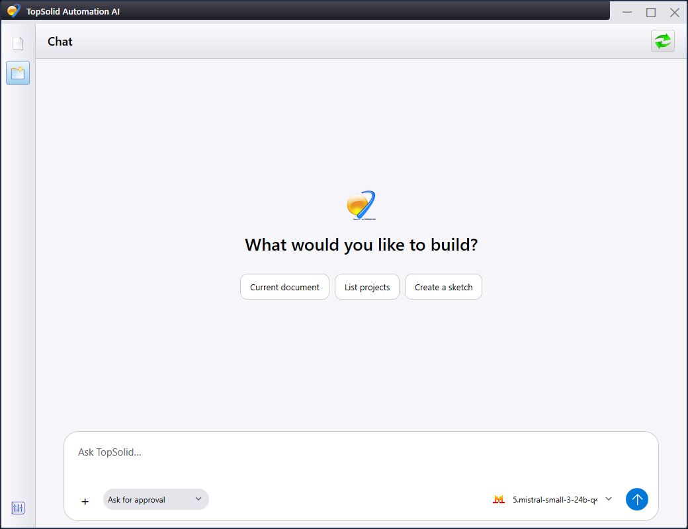
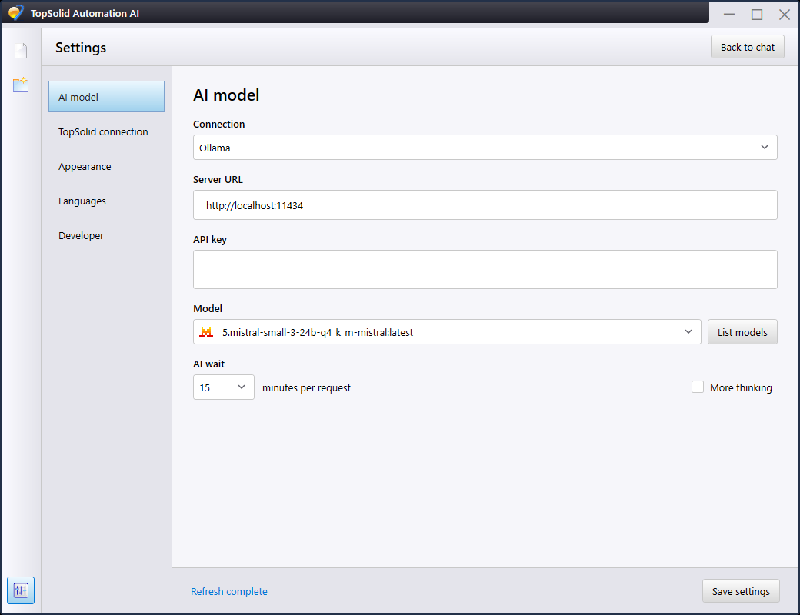
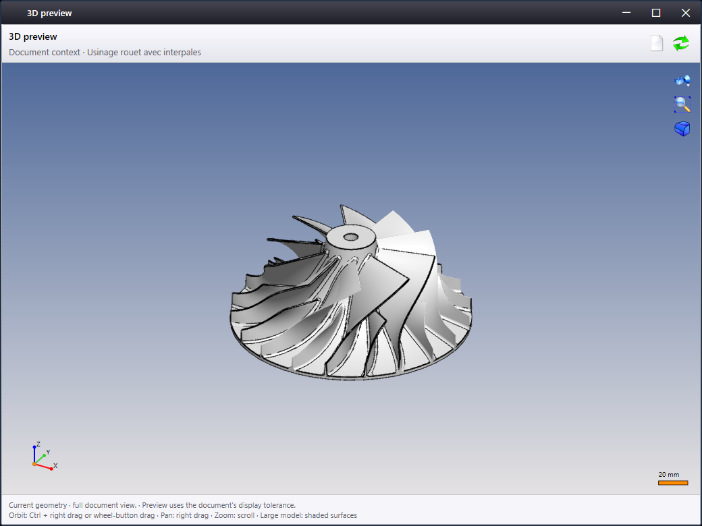

# TopSolid Automation AI — 0.5.21

[English](README.md) · [한국어](README.ko.md) · [Français](README.fr.md) · [Português](README.pt.md) · [日本語](README.ja.md) · **Deutsch**

Windows-Studio und separater MCP-Server für die TopSolid-Automatisierung. Studio kann eine Cloud-API oder einen lokalen Ollama-Server verwenden. Der MCP-Server liest echte TopSolid-Dokumente und CAM-Daten über die TopSolid Automation API; Änderungen benötigen eine sichtbare Bestätigung.

## Produktionsansicht von Studio

Die Aufnahmen stammen aus der veröffentlichten Windows-Anwendung, nicht aus dem Entwicklermodus. Die Studio-Oberfläche ist auf Englisch eingestellt. Die 3D-Vorschau verwendet ausschließlich das bereits geöffnete TopSolid-CAM-Dokument. Die sichtbaren lokalen Modelle sind Mistral, Gemma und GPT-OSS.

  
  
  

Der Modellauswahldialog ordnet der ausgewählten Modellfamilie automatisch das passende Symbol zu und behält es auch vor Abschluss der Modellermittlung bei. Qwen und DeepSeek werden in den öffentlichen Aufnahmen nicht gezeigt.

## Schnellstart

Benötigt werden Windows x64, .NET 10 Desktop, .NET Framework 4.8 und eine lizenzierte TopSolid-Installation ab Version 7.18. Lassen Sie den gesamten Ordner `artifacts/TopSolid-AI-0.5.21` bestehen und starten Sie `TopSolid.Automation.AI.Studio.exe`. TopSolid muss in derselben Windows-Sitzung bereits geöffnet sein.

Wählen Sie Ollama oder eine Cloud-API, wählen Sie Mistral, Gemma oder GPT-OSS, führen Sie **List models** aus und speichern Sie mit **Save settings**. Danach kann das aktive Dokument gelesen oder eine schreibgeschützte 3D-Vorschau angefordert werden.

API-Schlüssel, SDK-DLLs und der lokale Offline-Cache der API-Dokumentation werden nicht veröffentlicht. Den vollständigen Umfang und die Validierungsgrenzen finden Sie im [englischen README](README.md).
